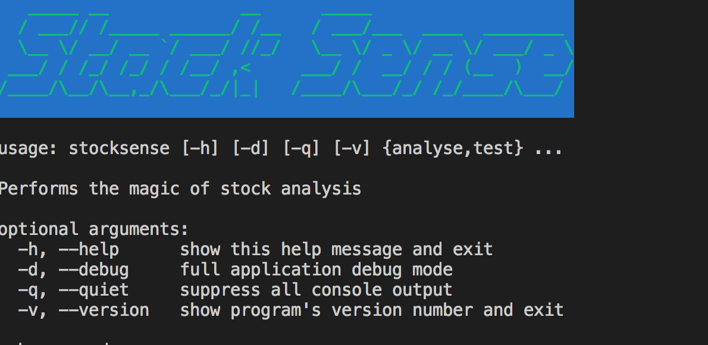

# StockSense

## Stock analysis automated at your fingertips



## Installation

```
$ pip install -r requirements.txt

$ pip install setup.py
```

## Development

Make sure you have cement installed.

This project includes a number of helpers in the `Makefile` to streamline common development tasks.

### Environment Setup

The following demonstrates setting up and working with a development environment:

```
### create a virtualenv for development

$ make virtualenv

$ source env/bin/activate


### run stocksense cli application

$ stocksense --help


### run pytest / coverage

$ make test
```

### Releasing to PyPi

Before releasing to PyPi, you must configure your login credentials:

**~/.pypirc**:

```
[pypi]
username = YOUR_USERNAME
password = YOUR_PASSWORD
```

Then use the included helper function via the `Makefile`:

```
$ make dist

$ make dist-upload
```

## Deployments

### Docker

Included is a basic `Dockerfile` for building and distributing `Stock Sense CLI`,
and can be built with the included `make` helper:

```
$ make docker

$ docker run -it stocksense --help
```
